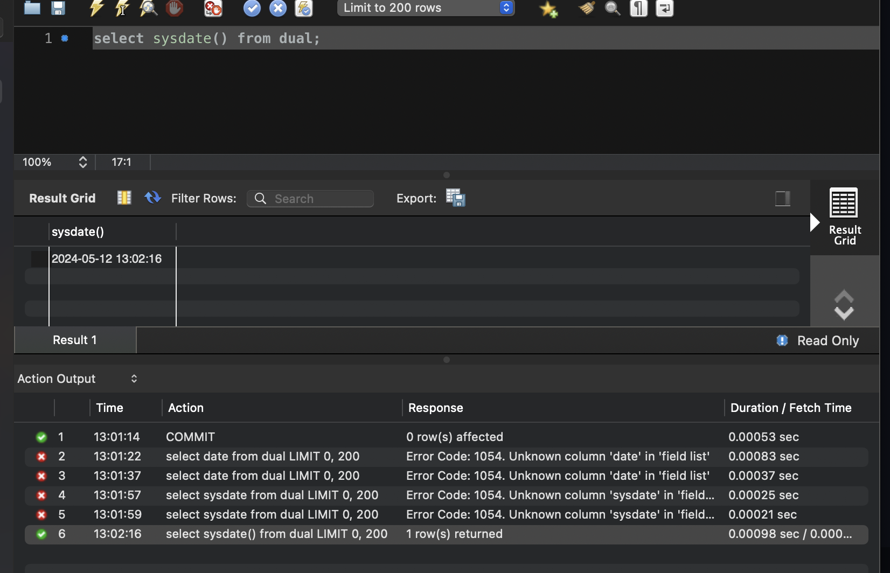

# Oracle
## critical db concepts
## SQL
## hitchhiker's guide to ORACLE8 data dictionary
## Designing for Productivity
## Alphabetical Reference
## Appendix 

Notes: 
1. SQL ~ sb query language
    a. learn terms
2. Front-end Screen
    a. JavaScript/HTML/CSS
        i. yahoo.com
            a. ugly
        ii. google.com
            b. pretty
            c. search-engine
                i. commoditize the approach to search
        iii. hac-frisco
            a. queries something
                i. SQL
                ii. Postgres
                iii. ECMAScript (google JS)
        iv. client utilities
            
    b.