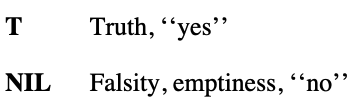

# rust. i love it. (don't know yet)
### https://www.scs.stanford.edu/~zyedidia/docs/rust/rust_book.pdf
# lisp
1. https://www.cs.cmu.edu/~dst/LispBook/book.pdf (carnegie mellon book.)
    
    
    chapter 1: functions and data.
        terms:
            1.0 - 1.4?
            1. functions
            2. data
            3. result
            4. 
            5. called / invoked
            6. returned
            7.
            8. 
            9. integers
            10. floating point
            11. ratios
            12. order of inputs is important (ie. like reverse polish)
            13. 
            14. 1.1 6, 7 +
                a. 
                b. 
            15. 
            1.5 ~ symbols
            16. integer
            17. symbol
            18. 
            19. 
                a. 
            1.7 ~ "some" simple predicates
            20. 
            21. 
            22. 
            23. 

# GNU / C
# linkedin people that might be amazing cool.

# highly cool shit on github
    1. https://gist.github.com/hayden-donnelly/483eb5182beabec3805e5d5ddf022806
    2. https://github.com/ggerganov/llama.cpp
# end
~ notes for me:
1. is there really something called an aura?
2. what the fuck does that mean: aura.
3. thank you for watching me learn @internet. siddhantx0.com out. love and best, siddhant singh